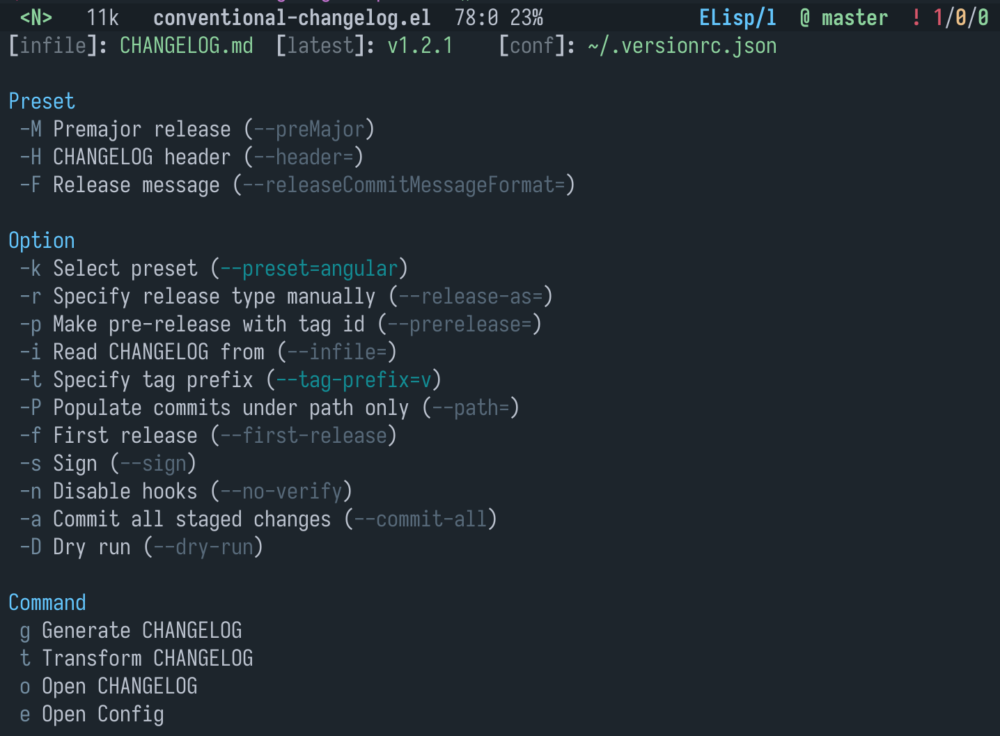
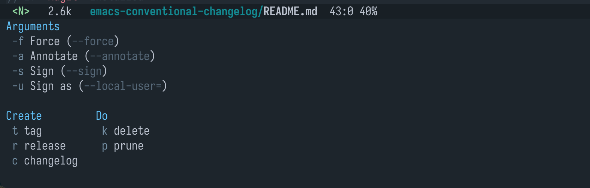

# conventional-changelog

[](LICENSE)
[](http://melpa.org/#/conventional-changelog)

Generate and update CHANGELOG file with [conventional-changelog][conventional-changelog] style in emacs.
This package provides the interface `conventional-changelog-menu`, which is
built with [transient][transient], between command-line tool [standard-version][standard-version] and emacs.
Call `conventional-changelog-menu` to start.

<!-- markdown-toc start -->

**Table of Contents**

- [conventional-changelog](#conventional-changelog)
  - [screenshot](#screenshot)
  - [Install](#install)
    - [dependencies](#dependencies)
    - [package](#package)
    - [useage](#useage)
  - [Feature](#feature)
  - [Comparison](#comparison)
  - [Todo](#todo)
  - [License](#license)

<!-- markdown-toc end -->

## screenshot

- Implemented with [transient][transient]:



- (OPTIONAL) Integrate with [magit][magit]:



## Install

### dependencies

- [standard-version][standard-version]

```sh
npm install -g standard-version
```

- (OPTIONAL) [pandoc][pandoc-install], `org-mode` required

```sh
# MacOS (for example)
brew install pandoc
```

### package

- Manually

Clone and add to `load-path`, require the package.

- Melpa

This package is available on [MELPA][melpa].
Install with `M-x package-install` <kbd>RET</kbd> `conventional-changelog` from within Emacs.

### useage

```elisp
;; Directly
(require 'conventional-changelog)
(with-eval-after-load 'magit-tag    ;; Integrate to `magit-tag'
  (transient-append-suffix 'magit-tag
    '(1 0 -1)
    '("c" "changelog" conventional-changelog-menu)))

;; Or with `use-package', etc
(use-package conventional-changelog
  :init
  (with-eval-after-load 'magit-tag
    (transient-append-suffix 'magit-tag
      '(1 0 -1)
      '("c" "changelog" conventional-changelog-menu))))
```

Call `conventional-changelog-menu`

## Feature

- Totally compatible with [standard-version#conf][standard-version#conf] by default
- Support both `CHANGELOG.md` and `CHANGELOG.org`, selected automatically if exists in repository
- Options of `--release-as` and `--prerelease` is highly customizable
- Integration with [magit][magit]

## Comparison

There are some packages which generate CHANGELOG file, adheres to [Semantic Versioning][semantic versioning]

- [el-conventional-changelog][el-conventional-changelog]

  - Not compatible with `standard-version`
  - only support Org

- [markdown-changelog][markdown-changelog]
  - Don't follow conventional style
  - Only support Markdown

## Todo

- compress shell-command output
- asyc-shell-command

## License

See [LICENSE](LICENSE).

[conventional-changelog]: https://github.com/conventional-changelog/conventional-changelog
[transient]: https://github.com/magit/transient
[standard-version]: https://github.com/conventional-changelog/standard-version#as-global-bin
[magit]: https://github.com/magit/magit
[pandoc-install]: https://github.com/jgm/pandoc/blob/master/INSTALL.md
[standard-version#conf]: https://github.com/conventional-changelog/standard-version#configuration
[semantic versioning]: https://semver.org
[el-conventional-changelog]: https://github.com/johnlepikhin/el-conventional-changelog
[markdown-changelog]: https://github.com/plandes/markdown-changelog
[melpa]: http://melpa.org/#/conventional-changelog
