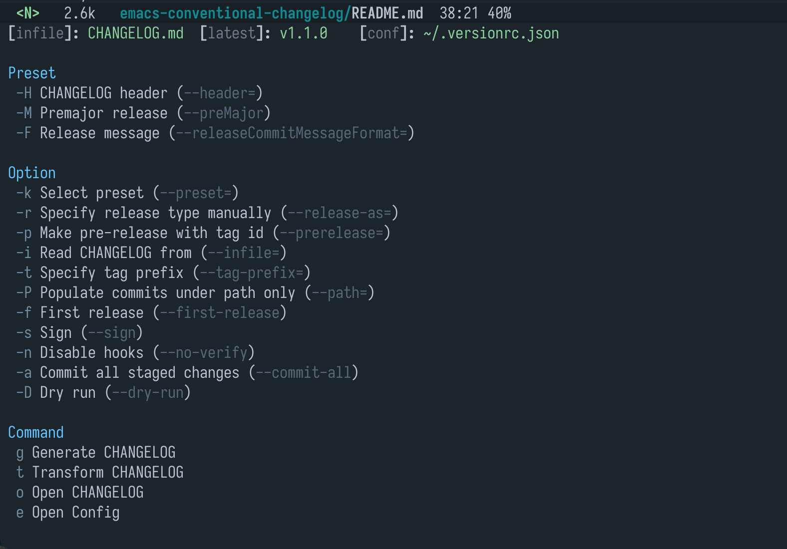

# conventional-changelog.el

[](LICENSE)

Generate and update CHANGELOG file in a git repository, which use [standard-version](https://github.com/conventional-changelog/standard-version).
This package is a plugin of [conventional-changelog](https://github.com/conventional-changelog/conventional-changelog), inspired by [el-conventional-changelog](https://github.com/johnlepikhin/el-conventional-changelog).

<!-- markdown-toc start -->

**Table of Contents**

- [conventional-changelog.el](#conventional-changelogel)
  - [screenshot](#screenshot)
  - [Install](#install)
    - [dependencies](#dependencies)
    - [package](#package)
    - [useage](#useage)
  - [Feature](#feature)
  - [Comparison](#comparison)
  - [Todo](#todo)
  - [License](#license)

<!-- markdown-toc end -->

## screenshot

- Implemented with [transient](https://github.com/magit/transient):



- Integrate with [magit](https://github.com/magit/magit):


## Install

### dependencies

- [standard-version](https://github.com/conventional-changelog/standard-version#as-global-bin)

```sh
npm install -g standard-version
```

- [pandoc](https://github.com/jgm/pandoc/blob/master/INSTALL.md) (OPTIONAL, org-mode required)

```sh
# MacOS (for example)
brew install pandoc
```

### package

- Manually

Clone and add to `load-path`, require the package.

- Melpa

This package is available on [MELPA Stable](https://stable.melpa.org/#/conventional-changelog) and
[MELPA](http://melpa.org/#/conventional-changelog). Install with `M-x package-install`
<kbd>RET</kbd> `conventional-changelog` from within Emacs.

### useage

```elisp
;; Directly
(require 'conventional-changelog)
;; if `Magit' installed
(conventional-changelog-integrate-magit)

;; Or with `leaf'
(leaf conventional-changelog
  :require t
  :config
  (conventional-changelog-integrate-magit))
```

Call `conventional-changelog-menu`

## Feature

- Support [configuration](https://github.com/conventional-changelog/standard-version#configuration) by default.
- Support both filetype of `CHANGELOG.md` and `CHANGELOG.org`, selected automatically if exists in repository.
- Integrate with [magit](https://github.com/magit/magit)
- Support preset of `--release-as` and `--prerelease` options with `conventional-changelog-release-preset`

## Comparison

With [el-conventional-changelog](https://github.com/johnlepikhin/el-conventional-changelog)

- don't use `standard-version`, no [configuration](https://github.com/conventional-changelog/standard-version#configuration) to customize
- only support Org style

## Todo

- compress shell-command output
- asyc-shell-command

## License

See [LICENSE](LICENSE).
